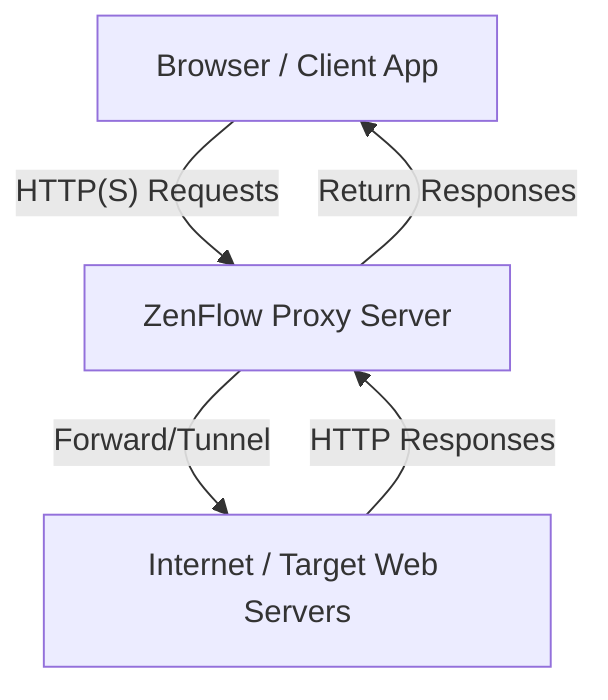
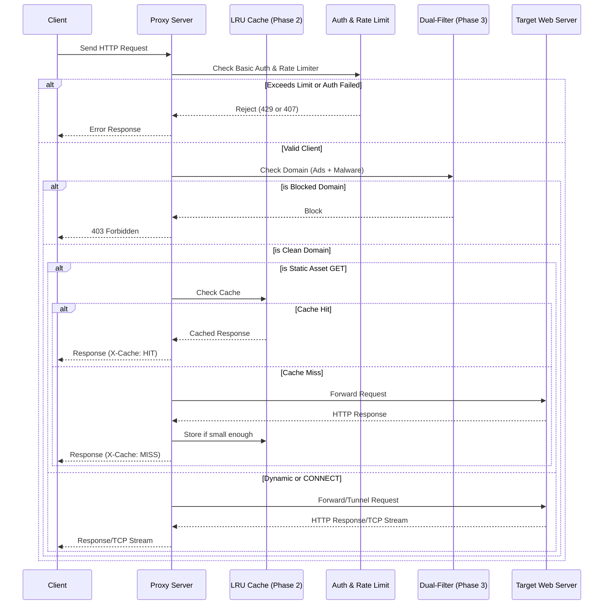

# HTTP Proxy Architecture

## System Context Diagram


## Request Flow


## Internal Component Architecture
```mermaid
graph LR
    subgraph cmd [cmd/proxy/]
        main[main.go - App Entry Point]
    end

    subgraph pkg [pkg/]
        proxy[proxy/ - HTTP Handlers & HTTPS Tunnel]
        filter[filter/ - Blocklists]
        logger[logger/ - Channel Logger (Phase 4)]
        ratelimit[ratelimit/ - Token Bucket]
        auth[auth/ - Basic Auth]
        tui[tui/ - Bubble Tea UI (Phase 4)]
        config[config/ - Auto Refresh & File Watcher]
    end

    main --> proxy
    main --> tui
    main --> config
    proxy --> filter
    proxy --> logger
    proxy --> ratelimit
    proxy --> auth
    tui --> logger
```
